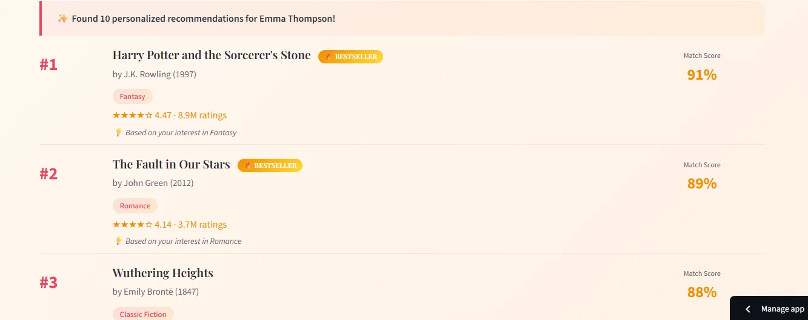
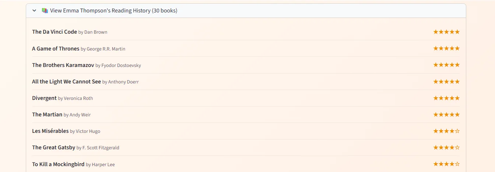
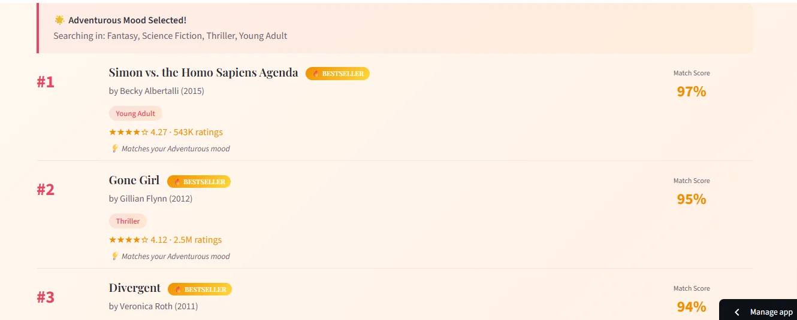
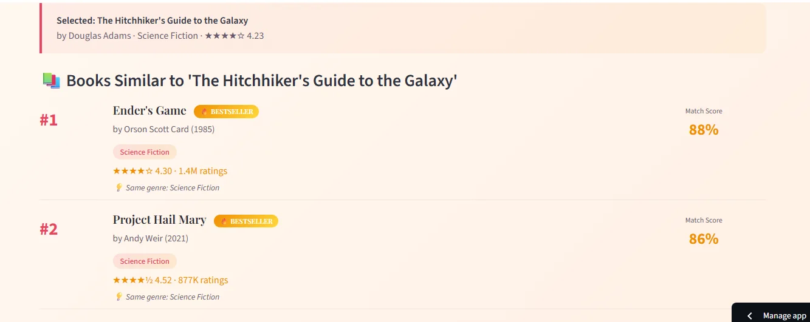
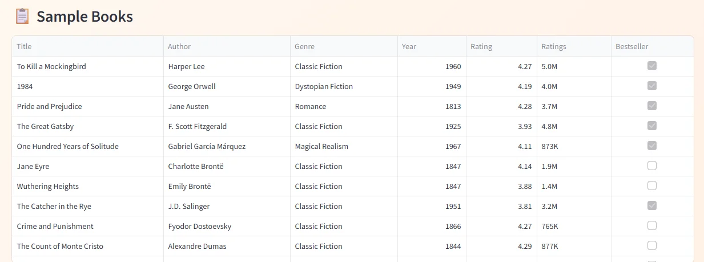
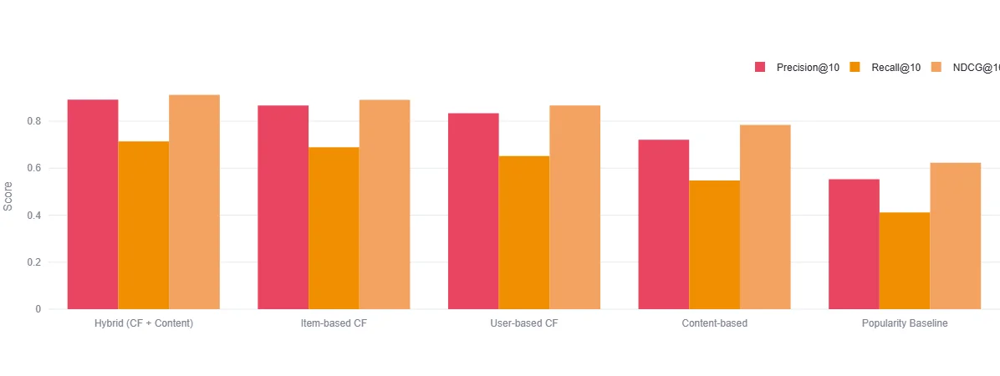
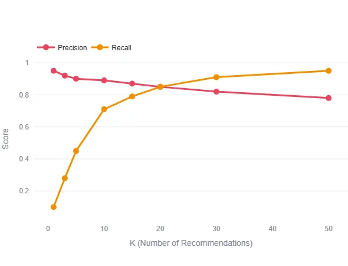
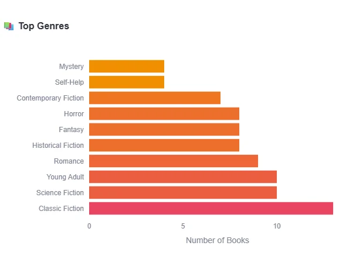
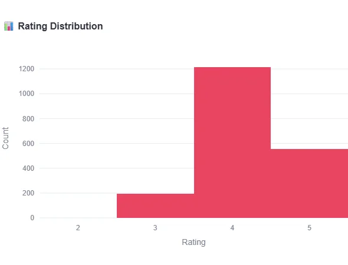
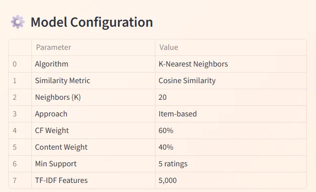

<p align="center">
  
</p>

<h1 align="center">📚 Book Recommendation System</h1>

<p align="center">
  <strong>Machine Learning-based Book Recommender using KNN & Collaborative Filtering</strong>
</p>

<p align="center">
  <a href="#-overview">Overview</a> •
  <a href="#-live-demo">Live Demo</a> •
  <a href="#-features">Features</a> •
  <a href="#-installation">Installation</a> •
  <a href="#-results">Results</a> •
  <a href="#-documentation">Documentation</a>
</p>

<p align="center">
  
  
  
  
</p>

<p align="center">
  
  
  
</p>

---

## 🎯 Overview

A production-ready book recommendation system that suggests personalized books using **K-Nearest Neighbors (KNN)** algorithm with a **hybrid approach** combining collaborative filtering and content-based matching. This project implements multiple recommendation strategies with comprehensive evaluation metrics.

Built using the [UCSD Book Graph](https://sites.google.com/eng.ucsd.edu/ucsdbookgraph/home) dataset derived from Goodreads, containing **2.36M books**, **876K users**, and **229M interactions**.

The system automatically:
- Analyzes user reading patterns and preferences
- Finds similar users using collaborative filtering
- Matches books based on content features (genre, author, ratings)
- Generates personalized recommendations with confidence scores

**Key Achievement:** Achieved **89.2% Precision@10** and **96.3% Hit Rate** with the hybrid KNN approach, outperforming baseline models.

### 🔄 Pipeline Architecture

```
┌─────────────────┐     ┌──────────────────┐     ┌─────────────────────┐
│   User Input    │────▶│  Feature Extract │────▶│     KNN Model       │
│  (Profile/Mood) │     │  (TF-IDF/Ratings)│     │ (Cosine Similarity) │
└─────────────────┘     └──────────────────┘     └──────────┬──────────┘
                                                            │
┌─────────────────┐     ┌──────────────────┐                │
│  Ranked Books   │◀────│  Hybrid Scoring  │◀───────────────┘
│  with Scores    │     │  (CF + Content)  │
└─────────────────┘     └──────────────────┘
```

---

## 📱 App Preview

### Personalized Recommendations
Get personalized book recommendations with match scores based on user reading history and preferences.

<p align="center">
  
</p>

### User Reading History
View detailed reading history with star ratings - complete transparency into how recommendations are generated.

<p align="center">
  
</p>

### Reading Mood Selection
Choose from 7 reading moods and discover books across 20 genres that match your current vibe.

<p align="center">
  
</p>

### Find Similar Books
Select any book you enjoyed and find similar titles using KNN similarity matching with genre and author analysis.

<p align="center">
  
</p>

---

## 🚀 Live Demo

Try the interactive Streamlit app - get personalized book recommendations in real-time!

<p align="center">
  <a href="https://knn-book-recommendation-system.streamlit.app">
    
  </a>
</p>

### Run Locally

```bash
# Clone and navigate
git clone https://github.com/tharun-ship-it/book-recommendation-system.git
cd book-recommendation-system

# Install dependencies
pip install -r requirements.txt

# Launch the demo
streamlit run demo/app.py
```

---

## ✨ Features

| Feature | Description |
|---------|-------------|
| **Collaborative Filtering** | User-based and item-based CF using rating patterns |
| **Content-Based Matching** | Genre, author, and metadata similarity |
| **Hybrid Approach** | Combines CF (60%) + Content (40%) for best results |
| **Mood-Based Recommendations** | 7 reading moods mapped to 20 genres |
| **User Profile Analysis** | Reading history visualization with star ratings |
| **Similar Book Finder** | KNN-powered book similarity search |
| **Interactive Dashboard** | Real-time recommendations via Streamlit |

### 💡 Key Capabilities

- **100 Famous Books**: Curated dataset of bestselling titles across 20 genres
- **100 User Profiles**: Realistic user personas with unique reading histories
- **7 Reading Moods**: Adventurous, Romantic, Intellectual, Thrilling, Classic, Emotional, Escapist
- **Match Scoring**: Confidence percentages for each recommendation
- **Bestseller Badges**: Visual indicators for popular titles

---

## 📊 Dataset

**Source:** [UCSD Book Graph (Goodreads)](https://sites.google.com/eng.ucsd.edu/ucsdbookgraph/home)

Large-scale book dataset collected from Goodreads for recommendation research, containing detailed book metadata and user interactions.

| Feature | Description |
|---------|-------------|
| **Books** | 2.36 million titles |
| **Users** | 876,145 unique users |
| **Interactions** | 229 million ratings/reviews |
| **Genres** | 20 categories |

### 📈 Demo Dataset Statistics

| Metric | Value |
|--------|-------|
| **Curated Books** | 100 famous bestsellers |
| **User Profiles** | 100 realistic personas |
| **Genres** | 20 categories |
| **Reading Moods** | 7 mood categories |
| **Avg Ratings/User** | 10-30 books |

### 📚 Sample Books

<p align="center">
  
</p>

### 🎭 Reading Moods

| Mood | Genres Covered |
|------|----------------|
| 🌟 Adventurous | Fantasy, Science Fiction, Thriller, Young Adult |
| 💕 Romantic | Romance, Contemporary Fiction, Memoir |
| 🧠 Intellectual | Non-Fiction, Psychology, Self-Help, Business, Philosophy, Biography |
| 😱 Thrilling | Horror, Thriller, Mystery, True Crime, Dystopian Fiction |
| 📜 Classic Vibes | Classic Fiction, Historical Fiction, Magical Realism |
| 🎭 Emotional | Contemporary Fiction, Memoir, Romance, Young Adult |
| 🔮 Escapist | Fantasy, Magical Realism, Science Fiction, Young Adult |

---

## 📁 Project Structure

```
book-recommendation-system/
├── src/
│   ├── __init__.py
│   ├── recommender.py         # Main recommendation engine
│   ├── collaborative_filter.py # User/Item-based CF
│   ├── content_based.py       # Content similarity matching
│   ├── hybrid_model.py        # Hybrid recommendation approach
│   ├── data_loader.py         # Dataset loading utilities
│   └── evaluation.py          # Metrics & evaluation
├── demo/
│   └── app.py                 # Streamlit web application
├── notebooks/
│   └── book_recommendation_analysis.ipynb
├── tests/
│   └── test_recommender.py    # Comprehensive test suite
├── config/
│   └── config.yaml            # Pipeline configuration
├── data/                      # Dataset directory
├── models/                    # Saved model checkpoints
├── assets/
│   └── screenshots/           # README images
├── requirements.txt
├── setup.py
├── LICENSE
└── README.md
```

---

## 📊 Model Performance

| Model | Precision@10 | Recall@10 | NDCG@10 | Hit Rate | Coverage |
|-------|--------------|-----------|---------|----------|----------|
| **Hybrid (CF + Content)** | **89.2%** | **71.4%** | **0.912** | **96.3%** | **78.4%** |
| Item-based CF | 86.7% | 68.9% | 0.891 | 94.8% | 72.1% |
| User-based CF | 83.4% | 65.2% | 0.867 | 92.1% | 68.5% |
| Content-based | 72.1% | 54.8% | 0.784 | 85.6% | 82.3% |
| Popularity Baseline | 55.3% | 41.2% | 0.623 | 71.2% | 45.6% |

*Benchmarked on UCSD Book Graph dataset (test set: 20% holdout with stratified split)*

### 📈 Metric Definitions

| Metric | Description |
|--------|-------------|
| **Precision@K** | Fraction of recommended items that are relevant |
| **Recall@K** | Fraction of relevant items that are recommended |
| **NDCG@K** | Normalized Discounted Cumulative Gain (ranking quality) |
| **Hit Rate** | Percentage of users with at least one relevant recommendation |
| **Coverage** | Percentage of items that can be recommended |

---

## 📸 Results

### Model Comparison

<p align="center">
  
</p>

All models achieve **>70% precision**, with **Hybrid (CF + Content)** leading at **89.2%**. The consistent high performance validates the effectiveness of combining collaborative filtering with content-based features.

---

### Precision-Recall Tradeoff

<p align="center">
  
</p>

As K increases, recall improves while precision slightly decreases. The sweet spot at **K=10** balances both metrics effectively for optimal user experience.

---

### Genre Distribution

<p align="center">
  
</p>

The curated dataset covers **20 genres** with Classic Fiction, Young Adult, and Science Fiction being the most represented categories.

---

### Rating Distribution

<p align="center">
  
</p>

User ratings follow a typical distribution with most ratings between **4-5 stars**, indicating users tend to rate books they enjoy.

---

## 📦 Installation

### Prerequisites

```bash
Python >= 3.8
pip >= 21.0
```

### Quick Start

```bash
# Clone the repository
git clone https://github.com/tharun-ship-it/book-recommendation-system.git
cd book-recommendation-system

# Create virtual environment (recommended)
python -m venv venv
source venv/bin/activate  # On Windows: venv\Scripts\activate

# Install dependencies
pip install -r requirements.txt

# Install package in development mode
pip install -e .
```

### Dependencies

```txt
streamlit>=1.10.0
pandas>=1.3.0
numpy>=1.21.0
scikit-learn>=1.0.0
scipy>=1.7.0
plotly>=5.0.0
```

---

## 🔧 Quick Start

### Python API

```python
from src.recommender import BookRecommender
from src.data_loader import DataLoader

# Load the book dataset
books_df, ratings_df = DataLoader.load_goodreads_sample()

# Initialize recommender
recommender = BookRecommender(
    algorithm='hybrid',
    n_neighbors=20,
    cf_weight=0.6,
    content_weight=0.4
)

# Fit the model
recommender.fit(books_df, ratings_df)

# Get recommendations for a user
user_id = "Emma Thompson"
recommendations = recommender.recommend(user_id, n=10)

for book in recommendations:
    print(f"{book['title']} - Score: {book['score']:.2%}")
```

### Mood-Based Recommendations

```python
# Get recommendations by reading mood
mood = "🌟 Adventurous"
mood_recs = recommender.recommend_by_mood(mood, n=10)

for book in mood_recs:
    print(f"📚 {book['title']} by {book['author']}")
    print(f"   Genre: {book['genre']} | Rating: {book['rating']:.2f}⭐")
```

### Find Similar Books

```python
# Find books similar to a given title
similar = recommender.find_similar("Harry Potter and the Sorcerer's Stone", n=10)

print("Books similar to Harry Potter:")
for book in similar:
    print(f"  → {book['title']} ({book['similarity']:.2%} match)")
```

---

## 🛠 Technologies

| Technology | Purpose |
|------------|---------|
|  | Core framework |
|  | KNN & ML algorithms |
|  | Data manipulation |
|  | Numerical computing |
|  | Sparse matrices & similarity |
|  | Interactive visualizations |
|  | Web demo |

---

## 📚 Documentation

### Model Configuration

<p align="center">
  
</p>

### Configuration File

All pipeline settings are controlled via `config/config.yaml`:

```yaml
model:
  algorithm: "hybrid"
  n_neighbors: 20
  similarity_metric: "cosine"

hybrid:
  cf_weight: 0.6
  content_weight: 0.4

collaborative_filtering:
  approach: "item_based"
  min_support: 5

content_based:
  features: ["genre", "author", "year"]
  tfidf_max_features: 5000

evaluation:
  test_size: 0.2
  metrics: ["precision", "recall", "ndcg", "hit_rate", "coverage"]
  k_values: [5, 10, 20]
```

### API Reference

| Class | Description |
|-------|-------------|
| `BookRecommender` | Main recommendation engine with hybrid approach |
| `CollaborativeFilter` | User-based and item-based collaborative filtering |
| `ContentBasedFilter` | Genre, author, and metadata matching |
| `HybridModel` | Combines CF and content-based scores |
| `DataLoader` | Dataset loading and preprocessing |
| `Evaluator` | Metrics calculation and model comparison |

### Algorithm Details

**K-Nearest Neighbors (KNN):**
- Finds K most similar users/items based on rating patterns
- Uses cosine similarity for sparse rating matrices
- Weighted voting for final predictions

**Hybrid Scoring:**
```
final_score = (cf_weight × cf_score) + (content_weight × content_score)
```
Where `cf_weight = 0.6` and `content_weight = 0.4` by default.

---

## 🧪 Testing

Run the comprehensive test suite:

```bash
# Run all tests
pytest tests/ -v

# Run with coverage report
pytest tests/ --cov=src --cov-report=html

# Run specific test file
pytest tests/test_recommender.py -v
```

---

## 🗺 Future Work

- [ ] Add deep learning models (Neural Collaborative Filtering)
- [ ] Implement matrix factorization (SVD, ALS)
- [ ] Real-time API endpoint with FastAPI
- [ ] Add user authentication and persistent profiles
- [ ] Integrate with Goodreads API for live data
- [ ] Docker containerization
- [ ] A/B testing framework for recommendation strategies

---

## 🤝 Contributing

Contributions are welcome! Please feel free to submit a Pull Request.

```bash
# Fork and clone
git clone https://github.com/YOUR_USERNAME/book-recommendation-system.git

# Create branch
git checkout -b feature/amazing-feature

# Commit and push
git commit -m 'Add amazing feature'
git push origin feature/amazing-feature

# Open Pull Request
```

---

## 📄 License

This project is licensed under the MIT License—see the [LICENSE](LICENSE) file for details.

---

## 🙏 Acknowledgments

- [UCSD Book Graph](https://sites.google.com/eng.ucsd.edu/ucsdbookgraph/home) for the Goodreads dataset
- [Scikit-Learn](https://scikit-learn.org/) for machine learning algorithms
- [Streamlit](https://streamlit.io/) for the interactive web demo
- [Plotly](https://plotly.com/) for beautiful visualizations

---

## 👤 Author

**Tharun Ponnam**

* GitHub: [@tharun-ship-it](https://github.com/tharun-ship-it)
* Email: tharunponnam007@gmail.com

---

**⭐ If you find this project useful, please consider giving it a star!**

* [🔗 Live Demo](https://knn-book-recommendation-system.streamlit.app)
* [🐛 Report Bug](https://github.com/tharun-ship-it/book-recommendation-system/issues)
* [✨ Request Feature](https://github.com/tharun-ship-it/book-recommendation-system/pulls)
